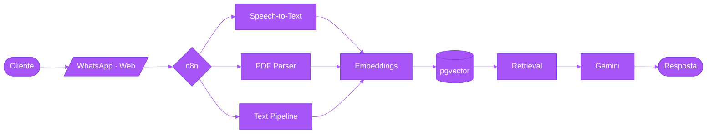

<!-- ════════════════════════════════════════════════════════════════
     HEADER — Banner adaptativo (light/dark)
════════════════════════════════════════════════════════════════ -->

<a href="https://github.com/kayque-santos">
  <picture>
    <source media="(prefers-color-scheme: dark)" srcset="./banner.svg" />
    
  </picture>
</a>

<div align="center">

<!-- Typing animado sutil — uma única linha de posicionamento -->


</div>

<br/>

<!-- ════════════════════════════════════════════════════════════════
     SOBRE
════════════════════════════════════════════════════════════════ -->

## <picture><source media="(prefers-color-scheme: dark)" srcset="https://raw.githubusercontent.com/microsoft/fluentui-emoji/main/assets/Waving%20hand/Flat/waving_hand_flat_default.svg"/></picture>&nbsp; whoami

Sou **Kayque Santos**, engenheiro e cientista de dados baseado em Serra/ES.
Atualmente atuo como **Analista de BI & Desenvolvimento de Dados na Efizi**,
onde construo soluções que vão da extração bruta até decisões executivas.

Trabalho na fronteira entre **engenharia, análise e IA aplicada** — desenhando
pipelines confiáveis, modelos analíticos e produtos baseados em LLMs que
saem do notebook e chegam à produção.

> _Acredito que o valor real do dado não está no volume, mas na confiança que
> uma organização deposita nele para tomar decisões._

<br/>

<!-- ════════════════════════════════════════════════════════════════
     NOW — O que estou fazendo agora (Derek Sivers' now.txt style)
════════════════════════════════════════════════════════════════ -->

## <picture><source media="(prefers-color-scheme: dark)" srcset="https://raw.githubusercontent.com/microsoft/fluentui-emoji/main/assets/Direct%20hit/Flat/direct_hit_flat.svg"/></picture>&nbsp; /now

```text
WORK       →  Construindo a camada analítica da Efizi sobre BigQuery + dbt
LEARNING   →  Engenharia de features · Apache Spark · Causal Inference
BUILDING   →  Arquiteturas RAG multimodais com Claude e Gemini
READING    →  Designing Data-Intensive Applications (M. Kleppmann)
NEXT       →  Certificação Google Cloud — Professional Data Engineer
```

<br/>

<!-- ════════════════════════════════════════════════════════════════
     STACK — Categorizada por uso
════════════════════════════════════════════════════════════════ -->

## <picture><source media="(prefers-color-scheme: dark)" srcset="https://raw.githubusercontent.com/microsoft/fluentui-emoji/main/assets/Hammer%20and%20wrench/Flat/hammer_and_wrench_flat.svg"/></picture>&nbsp; Stack

**Daily drivers** — uso todos os dias

`Python` · `SQL` · `PostgreSQL` · `BigQuery` · `dbt` · `Power BI` · `n8n` · `Git`

<br/>

**Toolbox** — uso regularmente conforme o projeto pede

<table>
<tr>
<td valign="top" width="33%">

###### Engenharia de Dados
- Airbyte · Airflow
- Databricks · Spark
- Docker · Linux
- GitHub Actions

</td>
<td valign="top" width="33%">

###### Ciência & Análise
- pandas · NumPy
- scikit-learn
- Jupyter · Plotly
- Estatística aplicada

</td>
<td valign="top" width="33%">

###### IA & Cloud
- Gemini · Claude
- pgvector · RAG
- GCP · AWS · Supabase
- Power Automate

</td>
</tr>
</table>

<br/>

<!-- ════════════════════════════════════════════════════════════════
     SHOWCASE — Projeto principal com profundidade
════════════════════════════════════════════════════════════════ -->

## <picture><source media="(prefers-color-scheme: dark)" srcset="https://raw.githubusercontent.com/microsoft/fluentui-emoji/main/assets/Sparkles/Flat/sparkles_flat.svg"/></picture>&nbsp; Selected Work

### Chatbot RAG Multimodal &nbsp;`featured`

Sistema de atendimento ao cliente automatizado capaz de processar **texto, áudio e
documentos PDF** numa única conversa contextual. Orquestrado em n8n, com Gemini
como modelo de linguagem e Supabase pgvector como camada de recuperação semântica.

**O que aprendi construindo:**
- Trade-offs entre latência e qualidade em recuperação vetorial
- Estratégias de chunking para documentos heterogêneos
- Observabilidade de pipelines de IA em produção



`Gemini` `n8n` `Supabase` `pgvector` `Python`

<br/>

### Outros projetos

<table>
<tr>
<td width="50%" valign="top">

###### 📈 Observabilidade de Dados
Dashboards em **Grafana** conectados a PostgreSQL e BigQuery
para monitoramento em tempo real de pipelines de ETL e qualidade
de chatbot RAG em produção.

`Grafana` · `PostgreSQL` · `BigQuery`

</td>
<td width="50%" valign="top">

###### 🕷️ Inteligência Competitiva
Pipeline de **web scraping** para coleta automatizada de preços
de concorrentes e dados logísticos, com consumo direto em
dashboards de BI.

`Python` · `BeautifulSoup` · `Power BI`

</td>
</tr>
<tr>
<td width="50%" valign="top">

###### 🔄 Pipelines ELT corporativos
Ingestão de dados de **ERPs (Bling, Anymarket)** em PostgreSQL
e BigQuery, com monitoramento de falhas e métricas de
consistência via dbt.

`Python` · `n8n` · `dbt` · `BigQuery`

</td>
<td width="50%" valign="top">

###### 📊 Camada analítica corporativa
Modelagem dimensional (star schema) sobre dados de marketplace,
logística e financeiro para alimentar relatórios estratégicos
em Power BI.

`dbt` · `BigQuery` · `DAX` · `Power BI`

</td>
</tr>
</table>

<br/>

<!-- ════════════════════════════════════════════════════════════════
     GITHUB STATS — Adaptativos light/dark
════════════════════════════════════════════════════════════════ -->

## <picture><source media="(prefers-color-scheme: dark)" srcset="https://raw.githubusercontent.com/microsoft/fluentui-emoji/main/assets/Bar%20chart/Flat/bar_chart_flat.svg"/></picture>&nbsp; Stats

<div align="center">

<picture>
  <source media="(prefers-color-scheme: dark)" srcset="https://github-readme-stats.vercel.app/api?username=kayque-santos&show_icons=true&hide_border=true&include_all_commits=true&count_private=true&hide=issues&title_color=A855F7&icon_color=A855F7&text_color=cbd5e1&bg_color=0d1117"/>
  
</picture>

<picture>
  <source media="(prefers-color-scheme: dark)" srcset="https://github-readme-stats.vercel.app/api/top-langs/?username=kayque-santos&layout=compact&hide_border=true&langs_count=8&title_color=A855F7&text_color=cbd5e1&bg_color=0d1117"/>
  
</picture>

</div>

<br/>

<!-- ════════════════════════════════════════════════════════════════
     CONTATO — Footer minimalista
════════════════════════════════════════════════════════════════ -->

## <picture><source media="(prefers-color-scheme: dark)" srcset="https://raw.githubusercontent.com/microsoft/fluentui-emoji/main/assets/Speech%20balloon/Flat/speech_balloon_flat.svg"/></picture>&nbsp; Contato

Aberto a colaborações em **engenharia de dados, ciência de dados e IA aplicada**.

<p>
<a href="https://linkedin.com/in/kayquesantos3434">
  
</a>
&nbsp;
<a href="mailto:kayques.es@gmail.com">
  
</a>
&nbsp;
<a href="https://github.com/kayque-santos">
  
</a>
</p>

<sub><i>kayques.es@gmail.com&nbsp; · &nbsp;Serra/ES — Brasil</i></sub>
