<!-- ════════════════════════════════════════════════════════════════
     HEADER — Banner adaptativo
════════════════════════════════════════════════════════════════ -->

<a href="https://github.com/kayque-santos">
  
</a>

<br/>

<!-- ════════════════════════════════════════════════════════════════
     SOBRE
════════════════════════════════════════════════════════════════ -->

## &nbsp;whoami

Sou **Kayque Santos**, engenheiro e cientista de dados baseado em Serra/ES.
Atualmente atuo como **Analista de BI & Desenvolvimento de Dados na Efizi**,
onde construo soluções que vão da extração bruta até decisões executivas.

Trabalho na fronteira entre **engenharia, análise e IA aplicada** — desenhando
pipelines confiáveis, modelos analíticos e produtos baseados em LLMs que
saem do notebook e chegam à produção.

> _Acredito que o valor real do dado não está no volume, mas na confiança que
> uma organização deposita nele para tomar decisões._

<br/>

<!-- ════════════════════════════════════════════════════════════════
     NOW
════════════════════════════════════════════════════════════════ -->

## &nbsp;/now

```text
WORK       →  Construindo a camada analítica da Efizi sobre BigQuery + dbt
LEARNING   →  Engenharia de features · Apache Spark · Causal Inference
BUILDING   →  Arquiteturas RAG multimodais com Claude e Gemini
READING    →  Designing Data-Intensive Applications (M. Kleppmann)
NEXT       →  Certificação Google Cloud — Professional Data Engineer
```

<br/>

<!-- ════════════════════════════════════════════════════════════════
     STACK
════════════════════════════════════════════════════════════════ -->

## &nbsp;Stack

**Daily drivers** — uso todos os dias

`Python` · `SQL` · `PostgreSQL` · `BigQuery` · `dbt` · `Power BI` · `n8n` · `Git`

<br/>

**Toolbox** — uso regularmente conforme o projeto pede

<table>
<tr>
<td valign="top" width="33%">

###### Engenharia de Dados
- Airbyte · Airflow
- Databricks · Spark
- Docker · Linux
- GitHub Actions

</td>
<td valign="top" width="33%">

###### Ciência & Análise
- pandas · NumPy
- scikit-learn
- Jupyter · Plotly
- Estatística aplicada

</td>
<td valign="top" width="33%">

###### IA & Cloud
- Gemini · Claude
- pgvector · RAG
- GCP · AWS · Supabase
- Power Automate

</td>
</tr>
</table>

<br/>

<!-- ════════════════════════════════════════════════════════════════
     SELECTED WORK
════════════════════════════════════════════════════════════════ -->

## &nbsp;Selected Work

### Chatbot RAG Multimodal &nbsp;`featured`

Sistema de atendimento ao cliente automatizado capaz de processar **texto, áudio e
documentos PDF** numa única conversa contextual. Orquestrado em n8n, com Gemini
como modelo de linguagem e Supabase pgvector como camada de recuperação semântica.

**O que aprendi construindo:**
- Trade-offs entre latência e qualidade em recuperação vetorial
- Estratégias de chunking para documentos heterogêneos
- Observabilidade de pipelines de IA em produção


`Gemini` · `n8n` · `Supabase` · `pgvector` · `Python`

<br/>

### Outros projetos

<table>
<tr>
<td width="50%" valign="top">

###### Observabilidade de Dados
Dashboards em **Grafana** conectados a PostgreSQL e BigQuery
para monitoramento em tempo real de pipelines de ETL e qualidade
de chatbot RAG em produção.

`Grafana` · `PostgreSQL` · `BigQuery`

</td>
<td width="50%" valign="top">

###### Inteligência Competitiva
Pipeline de **web scraping** para coleta automatizada de preços
de concorrentes e dados logísticos, com consumo direto em
dashboards de BI.

`Python` · `BeautifulSoup` · `Power BI`

</td>
</tr>
<tr>
<td width="50%" valign="top">

###### Pipelines ELT corporativos
Ingestão de dados de **ERPs (Bling, Anymarket)** em PostgreSQL
e BigQuery, com monitoramento de falhas e métricas de
consistência via dbt.

`Python` · `n8n` · `dbt` · `BigQuery`

</td>
<td width="50%" valign="top">

###### Camada analítica corporativa
Modelagem dimensional (star schema) sobre dados de marketplace,
logística e financeiro para alimentar relatórios estratégicos
em Power BI.

`dbt` · `BigQuery` · `DAX` · `Power BI`

</td>
</tr>
</table>

<br/>

<!-- ════════════════════════════════════════════════════════════════
     STATS
════════════════════════════════════════════════════════════════ -->

## &nbsp;Stats

<div align="center">

<!-- Profile Summary Cards — funcionam mesmo com o github-readme-stats fora do ar -->
<a href="https://github.com/kayque-santos">
  
</a>

<br/><br/>

<a href="https://github.com/kayque-santos">
  
</a>
&nbsp;
<a href="https://github.com/kayque-santos">
  
</a>

<br/><br/>

<a href="https://github.com/kayque-santos">
  
</a>
&nbsp;
<a href="https://github.com/kayque-santos">
  
</a>

</div>

<br/>

<!-- ════════════════════════════════════════════════════════════════
     CONTATO
════════════════════════════════════════════════════════════════ -->

## &nbsp;Contato

Aberto a colaborações em **engenharia de dados, ciência de dados e IA aplicada**.

<p>
<a href="https://linkedin.com/in/kayquesantos3434">
  
</a>
&nbsp;
<a href="mailto:kayques.es@gmail.com">
  
</a>
&nbsp;
<a href="https://github.com/kayque-santos">
  
</a>
</p>

<sub><i>kayques.es@gmail.com&nbsp; · &nbsp;Serra/ES — Brasil</i></sub>
