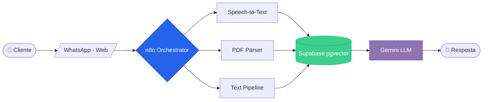
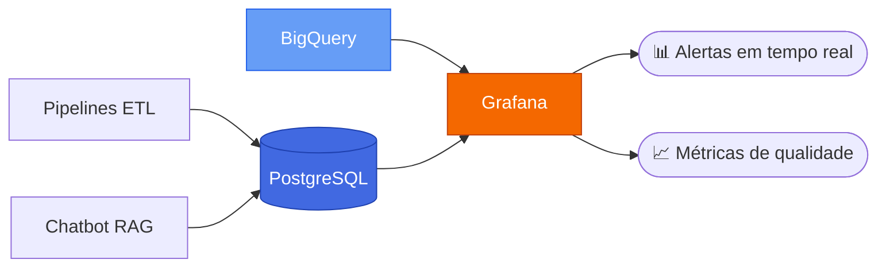
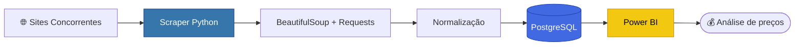
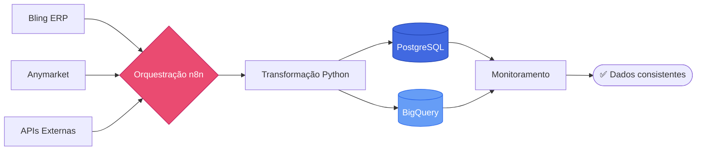

<!-- ============================================================ -->
<!--  HERO — Banner animado                                       -->
<!-- ============================================================ -->

<div align="center">

<a href="https://github.com/kayque-santos">
  
</a>

<br/>

<!-- Typing animado — especializações -->
<a href="https://git.io/typing-svg">
  
</a>

<br/><br/>

<!-- Identificadores rápidos -->
<a href="https://linkedin.com/in/kayquesantos3434">
  
</a>
<a href="mailto:kayques.es@gmail.com">
  
</a>
<a href="https://github.com/kayque-santos?tab=followers">
  
</a>


</div>

<br/>

<!-- ============================================================ -->
<!--  SOBRE                                                       -->
<!-- ============================================================ -->

##  Sobre mim

<table>
<tr>
<td valign="top" width="60%">

Sou **Engenheiro & Cientista de Dados** com base em Serra/ES, atualmente
atuando como **Analista de BI & Desenvolvimento de Dados** na **Efizi**.

Construo soluções **end-to-end**: da extração de dados (web scraping,
APIs, ERPs) até modelagem analítica, dashboards estratégicos e
aplicações com **LLMs em produção**.

> *"Dados confiáveis geram decisões melhores  —  decisões melhores geram negócios melhores."*

**Atualmente focado em:**

- Arquiteturas escaláveis de dados com **Modern Data Stack**
- Modelos preditivos e estatística aplicada a problemas de negócio
- Sistemas **RAG multimodais** e orquestração de agentes
- Observabilidade e qualidade de dados em produção

</td>
<td valign="top" width="40%">

```yaml
👤 Kayque Santos
🏢 Efizi  ─ Analista de BI & Dados
🎓 ADS    ─ Faculdade UCL
📍 Serra, ES — Brasil

🧠 Engenharia de Dados
🧪 Ciência de Dados
📊 Business Intelligence
🤖 LLMs & IA Generativa

⚙️  Modern Data Stack
🔁 Automação Inteligente
☁️  Cloud-first
```

</td>
</tr>
</table>

<br/>

<!-- ============================================================ -->
<!--  STACK                                                       -->
<!-- ============================================================ -->

##  Stack Técnica

<table>
<tr>
<td valign="top" width="50%">

#### 🛠️ Engenharia de Dados
<p>


</p>

#### 🧪 Ciência de Dados
<p>


</p>

#### ☁️ Cloud & Bancos
<p>


</p>

</td>
<td valign="top" width="50%">

#### 📊 BI & Visualização
<p>


</p>

#### 🤖 IA & LLMs
<p>


</p>

#### ⚙️ DevOps & Ferramentas
<p>


</p>

</td>
</tr>
</table>

<br/>

<!-- ============================================================ -->
<!--  PROJETOS EM DESTAQUE                                        -->
<!-- ============================================================ -->

##  Projetos em destaque

<br/>

### 🤖 Chatbot RAG Multimodal

> Atendimento ao cliente automatizado com **texto, áudio e PDF**.
> Arquitetura orquestrada em **n8n** com **Gemini** como LLM e
> **Supabase pgvector** para recuperação semântica contextual.



`Gemini` `n8n` `Supabase` `pgvector` `Python`

---

### 📈 Observabilidade de Dados

> Dashboards em **Grafana** conectados a **PostgreSQL** e **BigQuery**
> para monitoramento em tempo real de pipelines de ETL e
> qualidade de chatbot RAG em produção.



`Grafana` `PostgreSQL` `BigQuery` `SQL`

---

### 🕷️ Inteligência Competitiva

> Pipeline de **web scraping** para coleta automatizada de preços
> de concorrentes e dados logísticos, com persistência em
> **PostgreSQL** e consumo direto em dashboards de BI.



`Python` `BeautifulSoup` `PostgreSQL` `Power BI`

---

### 🔄 Pipelines de ETL/ELT

> Ingestão de dados de **ERPs (Bling, Anymarket)** e fontes externas
> em **PostgreSQL** e **BigQuery**, com monitoramento de falhas e
> métricas de consistência.



`Python` `n8n` `BigQuery` `PostgreSQL` `Airbyte`

<br/>

<!-- ============================================================ -->
<!--  EM EVOLUÇÃO                                                 -->
<!-- ============================================================ -->

##  Em constante evolução

<table>
<tr>
<td valign="top" width="33%">

#### 🧠 Aprofundando
- Apache Spark & Databricks
- Arquiteturas Lakehouse
- MLOps & Model Serving
- Engenharia de features

</td>
<td valign="top" width="33%">

#### 🔭 Explorando
- Agentes autônomos (Claude · Gemini)
- Multi-agent orchestration
- Vector databases em escala
- Streaming com Kafka

</td>
<td valign="top" width="33%">

#### 🎯 Próximos passos
- Certificação GCP Data Engineer
- Aprofundar em Estatística Bayesiana
- Contribuições em open source
- Estudos em Causal Inference

</td>
</tr>
</table>

<br/>

<!-- ============================================================ -->
<!--  GITHUB STATS                                                -->
<!-- ============================================================ -->

##  GitHub em números

<div align="center">

<a href="https://github.com/kayque-santos">
  
</a>
<a href="https://github.com/kayque-santos">
  
</a>

<br/>

<a href="https://github.com/kayque-santos">
  
</a>

<br/><br/>

<!-- Trophies -->
<a href="https://github.com/kayque-santos">
  
</a>

<br/><br/>

<!-- Activity graph -->
<a href="https://github.com/kayque-santos">
  
</a>

</div>

<br/>

<!-- ============================================================ -->
<!--  FOOTER                                                      -->
<!-- ============================================================ -->

<div align="center">

### 💬 Vamos conversar?

Estou sempre aberto a colaborações em **projetos de dados, IA aplicada e automação inteligente**.

<br/>

<a href="https://linkedin.com/in/kayquesantos3434">
  
</a>
<a href="mailto:kayques.es@gmail.com">
  
</a>
<a href="https://github.com/kayque-santos">
  
</a>

<br/><br/>


<sub>⭐ <i>"Transformando dados em decisões — uma pipeline por vez."</i></sub>

</div>
